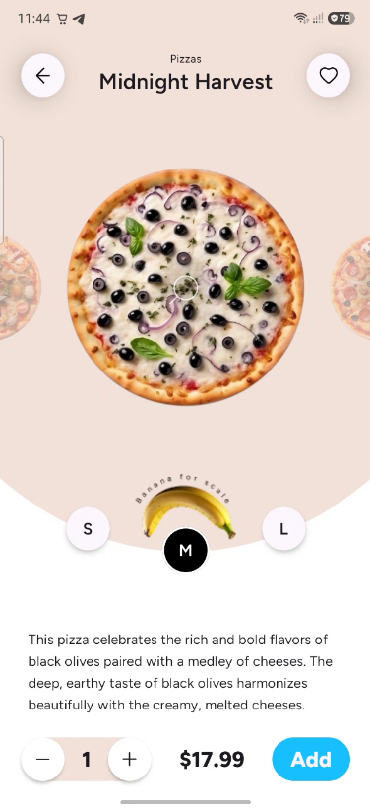

# Pizza Compose Multiplatform App

## 🍕 Overview

Pizza is a modern cross-platform mobile application built entirely with **Compose Multiplatform (
KMP)**.

This project serves as an advanced implementation showcase for building highly interactive,
pixel-perfect, <br>and ultra-fluid user interfaces optimized for fluid physics and food
customization.

The core focus of the application is delivering custom motion design experiences running at a
flawless **120 FPS**.

<table width="100%">
  <tr>
    <th width="50%" align="center">Main Home Screen</th>
    <th width="50%" align="center">FullScreen Interactive Zoom</th>
  </tr>
  <tr>
    <td align="center">
      
    </td>
    <td align="center">
      
    </td>
  </tr>
</table>
---

## 🚀 Features

- **120 FPS Infinite Loop Carousel**: <br>A customized `HorizontalPager` layer implementing complex
  dynamic multi-axis scale shifts, <br>alpha rollbacks, and layering offsets directly mapped to
  real-time scrolling deltas.
- **Dynamic Background Geometry**: <br>High-performance layout adjustments using smooth vector paths
  drawn manually on a native `Canvas` block that elegantly transitions upon screen entry.
- **Custom Gesture Flight Engine**: <br>A structural, high-fidelity object translation mechanism
  that captures exact device layout matrices (`onGloballyPositioned`) <br>to seamlessly scale a
  pizza item from a tiny carousel item into a viewport-centered preview window without standard
  navigation lifecycle jumps.
- **Multi-Touch Pinch-to-Zoom (up to 7x)**: <br>Comprehensive raw multi-pointer transformation and
  translation interceptors (`detectTransformGestures`) <br>that unlock free-form drag-and-zoom
  states once an item completes its initial scaling phase.
- **Predictive System Back Handling**: <br>Deeply unified cross-platform system navigation tracking
  hooks (`NavigationBackHandler`), <br>which gracefully catch system edge swiping to coordinate
  inverted layout landing paths back into the stable active carousel.

---

## 🛠️ Tech Stack

### Core

- **Kotlin** – 100% Kotlin Multiplatform shared source structure.
- **Compose Multiplatform (KMP)** – Declarative, unified native UI development engine across
  Android & iOS ecosystem nodes.
- **Coroutines + Flow** – Declarative asynchronous state operations and pipeline trackers (
  `snapshotFlow`).

### Architecture & Patterns

- **MVI (Model-View-Intent)** – Enforces strict Unidirectional Data Flow constraints.
- **Clean Architecture** – Distinct structural abstraction across view models and representation
  nodes.
- **Layered Overlay Pattern** – Handles high-performance overlay calculations over a frozen pager
  block stack, eliminating unnecessary list remeasuring issues.
- **State Phase Isolation** – View variables like `zoomProgress` are intercepted and evaluated right
  inside hardware draw commands. <br>This fully bypasses the heavy layout-recalculation phase to
  preserve constant hardware refresh steps.
- **Reusable Core Layout** – Renders high-fidelity raster targets safely in a dedicated composable
  called `PizzaImageCore`.

### Libraries & Tools

- **Jetpack Navigation Component (Type-Safe API)** – Compile-time static navigation route graph
  modeling utilizing Kotlin `@Serializable` objects.
- **NavigationEvent Compose** – JetBrains-optimized platform abstractions handling native predictive
  system execution handlers.
- **Koin** – Lightweight and pragmatic Dependency Injection framework for Kotlin Multiplatform.
- **Ktorfit** – HTTP client and Kotlin Symbol Processor (KSP) for type-safe REST API networking.
- **Kotlin Serialization** – Type-safe metadata parsing and bidirectional JSON serialization.
- **Coil 3** – Multiplatform image decoding pipeline supporting advanced caching mechanisms.

### Testing

- **JUnit**
- **Unit tests**
- **Integration tests**

Use the run button in your IDE's editor gutter, or run tests using Gradle tasks:

- Android tests: `./gradlew :shared:testAndroidHostTest`
- iOS tests: `./gradlew :shared:iosSimulatorArm64Test`

---

## 🏗️ Architecture

The codebase relies on a predictable **Clean Architecture** pattern cleanly divided across the
cross-platform source tree structure:

```
androidApp/
iosApp/
shared/
└── commonMain/
    ├── data/
    │   ├── repository/
    │   ├── network/
    │   └── usecase/
    ├── di/
    ├── domain/
    │   ├── model/
    │   ├── repository/
    │   └── usecase/
    └── presentation/ (ui)
        ├── base/
        ├── navigation/
        ├── screen/
        └── theme/
```

* [/androidApp](./androidApp) contains an Android application. Even if you're sharing your UI with
  Compose Multiplatform,
  <br>you need this entry point for your Android app. This is also where you should add
  platform-specific code or configurations for your project.

* [/iosApp](./iosApp/iosApp) contains an iOS application. Even if you’re sharing your UI with
  Compose Multiplatform,
  <br>you need this entry point for your iOS app. This is also where you should add SwiftUI code for
  your project.

* [/shared](./shared/src) is for code that will be shared across your Compose Multiplatform
  applications.
  It contains several subfolders:
    - [commonMain](./shared/src/commonMain/kotlin) is for code that’s common for all targets.
    - Other folders are for Kotlin code that will be compiled for only the platform indicated in the
      folder name.
      For example, if you want to use Apple’s CoreCrypto for the iOS part of your Kotlin app,
      the [iosMain](./shared/src/iosMain/kotlin) folder would be the right place for such calls.
      Similarly, if you want to edit the Desktop (JVM) specific part,
      the [jvmMain](./shared/src/jvmMain/kotlin)
      folder is the appropriate location.

---

## 🚀 How to Run Project

1. Clone the project repository code.
2. Execute **Sync Project with Gradle Files** within Android Studio.
3. Choose the target `androidApp` compilation module or <br>configure your preferred iOS compilation
   configuration <br>inside Xcode scheme builders to test performance.

- Android app: `./gradlew :androidApp:assembleDebug`
- iOS app: open the [/iosApp](./iosApp) directory in Xcode and run it from there.

---

Learn more
about [Kotlin Multiplatform](https://www.jetbrains.com/help/kotlin-multiplatform-dev/get-started.html)…